# chart-editor 
A low code chart editor based on vue3 ,echart and g2.  
一个基于Vue3全家桶和Echart打造的低代码图表编辑器。 

You can use it draw various charts easily.

# How to start 
1. git clone https://github.com/HHN0609/chart-editor.git 
2. `cd chart-editor`
3. Run `npm install`
4. Start your local Mysql service 
5. Change the default Mysql configuration in `./server/config.js` 
6. Copy the sql in `./server/sql/chart_editor_db.sql`, and paste it into your Mysql console. It will create a database called .`chart_editor_db`.
7. Run `npm run serve` to start the backend service on port 3000.
8. Run `npm run dev`. 
9. The root account is `root`, and the password is `123456`.
10. Let start this project!

# Chart Examples 
### Bar chart 
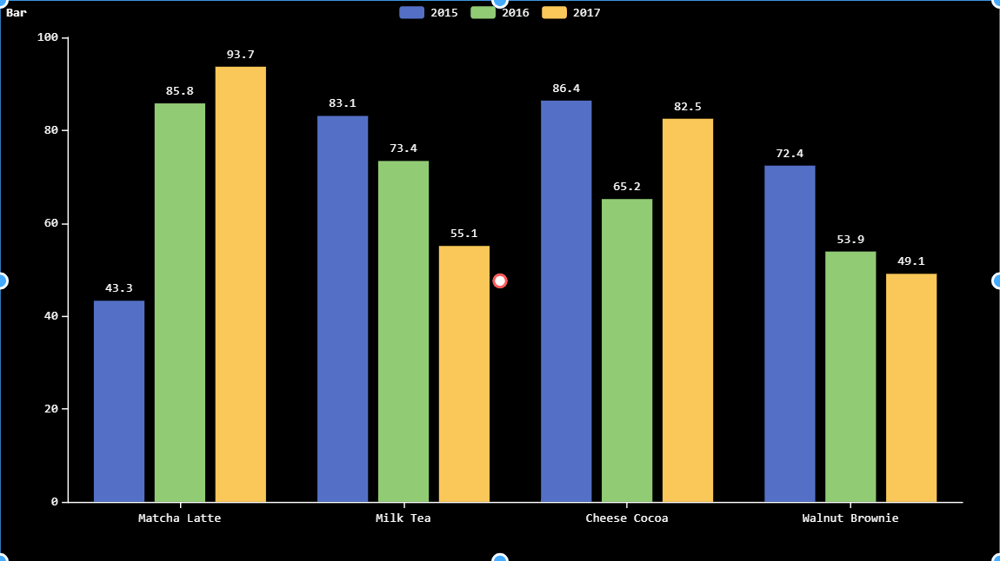 

### Line chart 
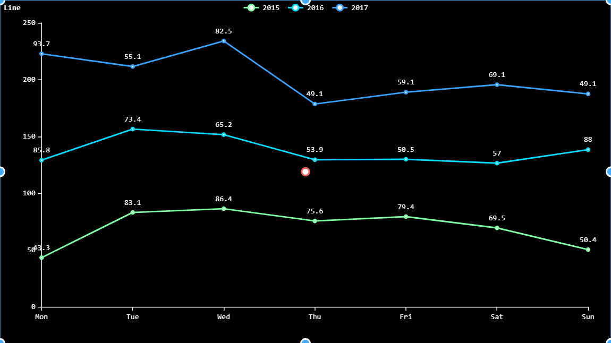 

### Line chart with area  
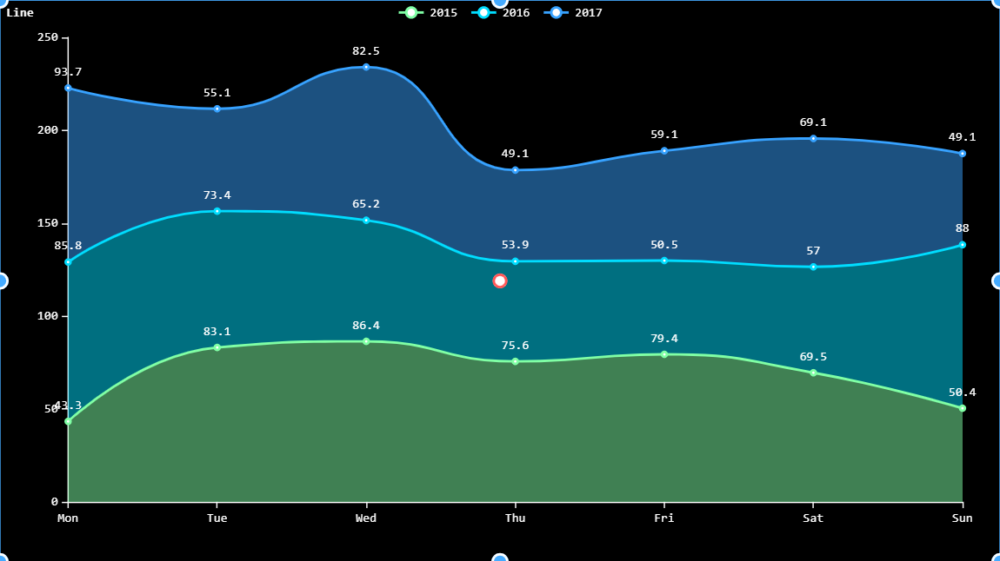 

### Pie chart   
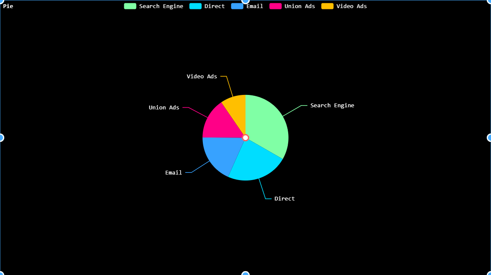 

### Rose chart  
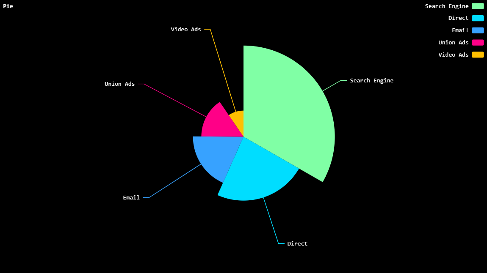 

### Donut chart  
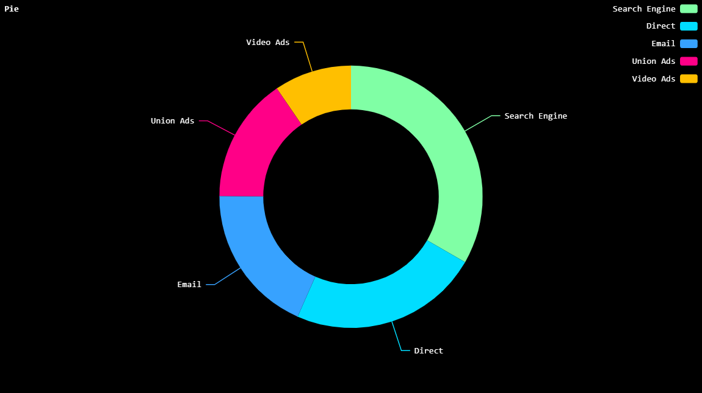 

### Radar chart  
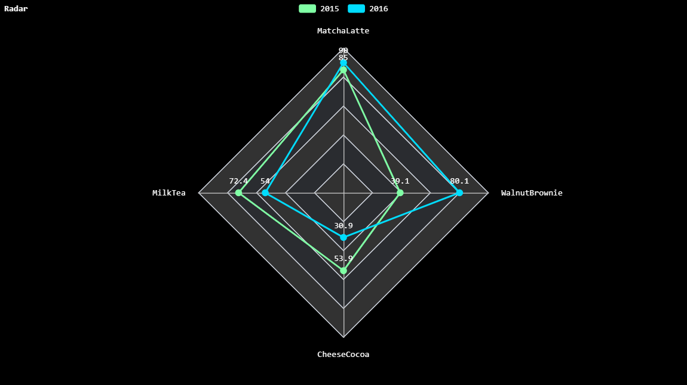 

### Radar chart with area  
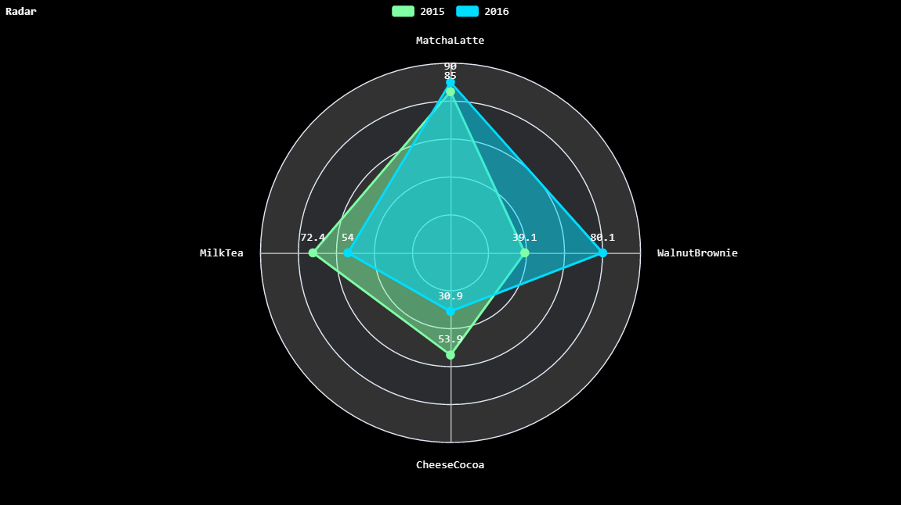

# Some runtime Pictures 
### DashBoard Page
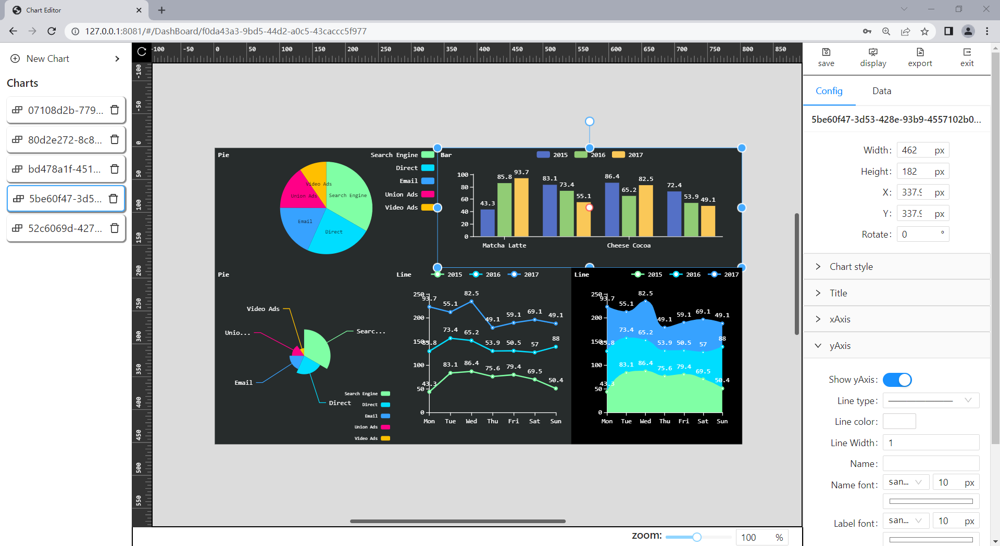 
### Home Page
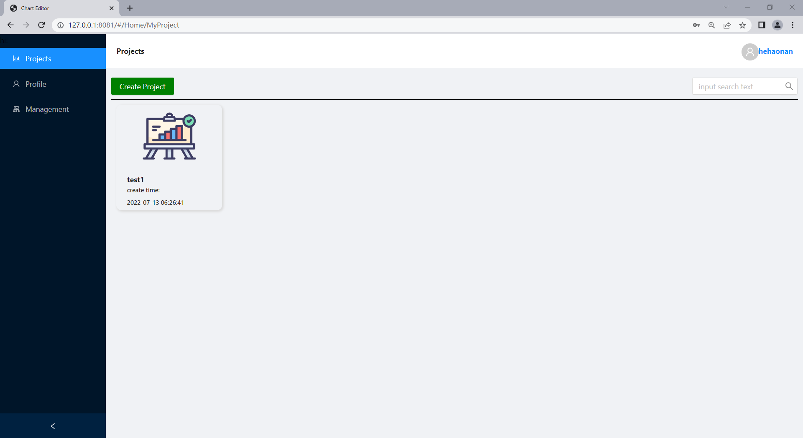  
### Export Image
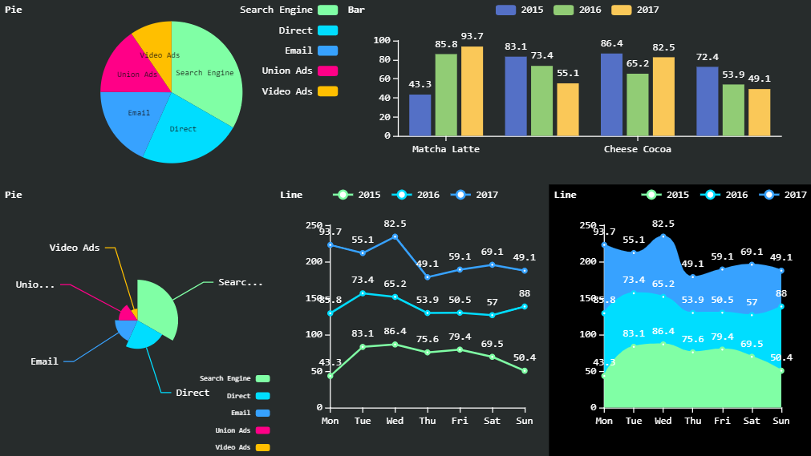 